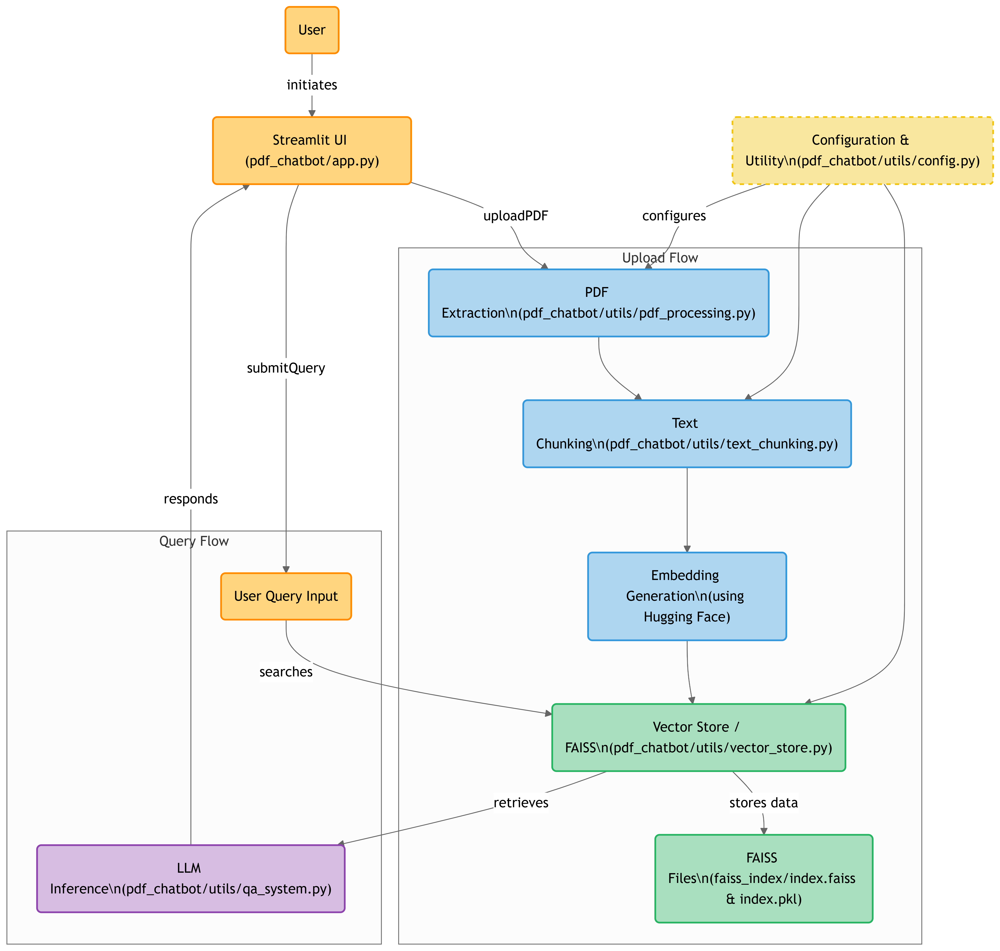

# RAG PDF Chatbot - 100% Local

This is a **Streamlit-based chatbot** that allows users to upload PDFs and ask questions about the content. It runs **entirely locally**, meaning no API costs, no internet requirements, and full privacy.

---
## Workflow


## Features
- 📂 Upload multiple PDFs
- 🔍 Vector search using **FAISS**
- 🧠 Embeddings with **Hugging Face models**
- 🤖 Uses **Ollama (Llama 2)** for local inference
- ⚡ No API keys required
- 🔒 Runs 100% on your local machine

---

## 🛠 Installation
### **1️⃣ Create a Virtual Environment** (Optional but recommended)
```bash
python -m venv pdf-chat-env
source pdf-chat-env/bin/activate  # On Windows: pdf-chat-env\Scripts\activate
```

### **2️⃣ Install Dependencies**
#### **Using `pip`**
```bash
pip install -r requirements.txt
```

#### **Using `conda` (for CPU versions only)**
```bash
conda install -c conda-forge pytorch transformers sentence-transformers faiss-cpu
pip install -r requirements.txt
```

---

## 🏗 Project Structure
```
📂 pdf-chatbot
├── 📄 app.py               # Main Streamlit app
├── 📂 modules
│   ├── process_pdf.py      # PDF processing (text extraction, chunking)
│   ├── vector_store.py     # FAISS vector database management
│   ├── llm_inference.py    # Running Ollama for answering queries
│   ├── config.py           # Configurations (chunk size, model settings)
│   ├── __init__.py         # Module initialization
├── 📂 faiss_index          # Saved FAISS index (generated after processing PDFs)
├── 📄 requirements.txt      # Dependencies
├── 📄 README.md            # This file
```

---

## ▶️ How to Run
```bash
streamlit run app.py
```
Then open **`http://localhost:8501`** in your browser.

---

## 📝 Usage
1. Upload one or more PDF files from the **sidebar**.
2. Set the **chunk size** (default: `300`).
3. Click **"Process Documents"** to generate embeddings.
4. Enter your question in the text box.
5. Get an AI-powered answer based on the PDFs!

---

## 🏗 Technologies Used
- **Streamlit** (Web UI)
- **PyPDF2** (PDF text extraction)
- **LangChain** (Text chunking, LLM inference)
- **FAISS** (Vector search)
- **Hugging Face Embeddings** (Text representations)
- **Ollama (Llama 2)** (Local LLM for answering queries)

---

## ⚠️ Troubleshooting
- **No answer or incorrect response?**
  - Ensure PDFs contain selectable text (scanned images won’t work)
  - Increase chunk size if responses lack context
- **Performance issues?**
  - Reduce chunk size for faster processing
  - Use `tinyllama` instead of `llama2` for quicker inference

---

## Future Enhancements
- ✅ Add support for **PDFs with scanned text (OCR)**
- ✅ Implement **multi-document summarization**
- ✅ Improve LLM response formatting and citations

---

## 💡 Credits & License
Developed by **Swagath Babu**. Free for personal and research use. 

